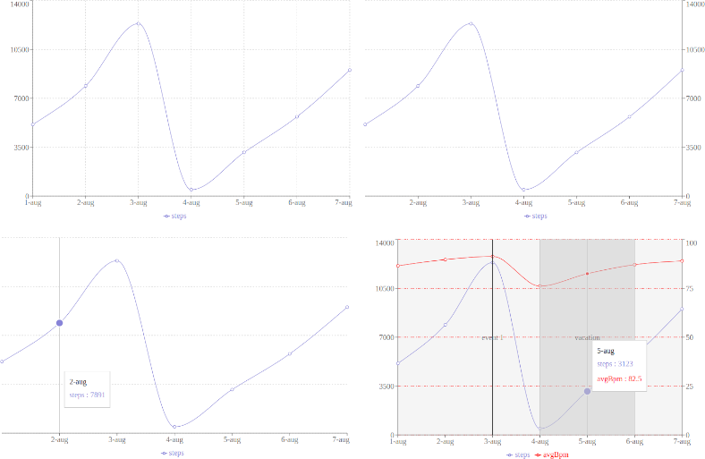

kotlin-recharts
===============

[](https://kotlinlang.org/docs/js-overview.html)
[](https://kotlinlang.org)
[](LICENSE)


Kotlin wrapper for [**ReCharts**](https://recharts.org/) (React charting library)

- for **recharts** version: [2.7.2](https://github.com/recharts/recharts/releases/tag/v2.7.2)

> [!CAUTION]
> **Work-In-Progress**: This library currently consists of wrappers only
> for a portion of components of the original `recharts` library.
>
> See [live demo](https://github.com/tonycode/kotlin-recharts#live-demo) and
> [usage examples](https://github.com/tonycode/kotlin-recharts#wrappers-implemented)
> to explore implemented features


## LIVE DEMO

> [!IMPORTANT]
> https://tonycode.dev/demos/kotlin-recharts-demo
>
> (it is a deployed module `demo` from this repository)

some screenshots:




## Usage

```kotlin
repositories {
    //...
    maven("https://s01.oss.sonatype.org/content/repositories/snapshots/")
}
```

```kotlin
implementation("dev.tonycode.kotlin-wrappers:kotlin-recharts:0.1.0-SNAPSHOT") {
    isChanging = true  // instruct Gradle to check for SNAPSHOT updates
}
```

```kotlin
import recharts.*
import web.cssom.Color
import web.cssom.pct


ResponsiveContainer {
    width = 100.pct
    height = 480

    LineChart {
        data = stubMeasurements.toTypedArray()

        CartesianGrid {
            strokeDash(3, 3)
        }
        XAxis {
            dataKey = Measurement::date.name
        }
        YAxis()

        Tooltip()
        Legend()

        Line {
            type = LineType.monotone
            dataKey = Measurement::steps.name
            stroke = Color("#8884d8")
            activeDot(8)
            isAnimationActive = false
        }
    }
}


@OptIn(ExperimentalJsExport::class)
@JsExport
data class Measurement(val date: String, val steps: Int, val avgBpm: Double)

val stubMeasurements = listOf(
    Measurement("1-aug", 5123, 86.5),
    Measurement("2-aug", 7891, 89.7),
    Measurement("3-aug", 12345, 91.3),
    Measurement("4-aug", 456, 76.2),
    Measurement("5-aug", 3123, 82.5),
    Measurement("6-aug", 5678, 87.1),
    Measurement("7-aug", 9023, 89.0),
)
```

### Usage examples for Components

Below is a list of references to demonstrational usage code in `demo` module

- [SimpleLineChart](demo/src/jsMain/kotlin/dev/tonycode/kotlin_wrappers/kotlin_recharts_demo/ui/screens/line_chart/SimpleLineChart.kt)
- [BiaxialLineChart](demo/src/jsMain/kotlin/dev/tonycode/kotlin_wrappers/kotlin_recharts_demo/ui/screens/line_chart/BiaxialLineChart.kt)


## Wrappers implemented

- Layout
    - `ResponsiveContainer`
- Grid
    - `CartesianGrid`
    - `XAxis`
    - `YAxis`
- Charting Elements
    - `Line`
    - `ReferenceLine`
    - `ReferenceArea`
- misc
    - `Tooltip`
    - `Legend`

Full list of `recharts` js-library Components: https://recharts.org/en-US/api


## License

[MIT](LICENSE)
